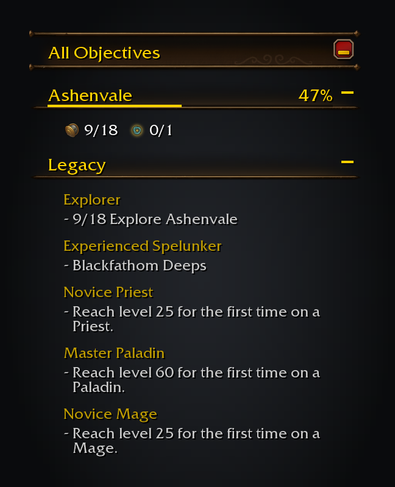

# The Legacy tracker

Forever doesn't allow Blizzard's own tracking of Legacy challenges, so Legacy Forever adds its own section to the
objective tracker, under the game's All Objectives header and above its quests. It lists only what you tick in the
map's Legacy menu, with live progress from the game.

The header, then Ashenvale's completion and each tracked challenge with its unfinished steps.

- **A zone's objective**, ticked in the map menu, tracks just that zone: the challenge as a header with a line under
  it, such as "0/12 Explore Felwood", and one line for each zone you tick.
- **A challenge under "No fixed location"** lists its unfinished steps: "12/20" for a counted step, or the areas done
  in an exploration step. Five show at most, with "..." after.
- **Click** a challenge to open it in the Legacy panel. **Right-click** for a menu that can stop tracking it.
