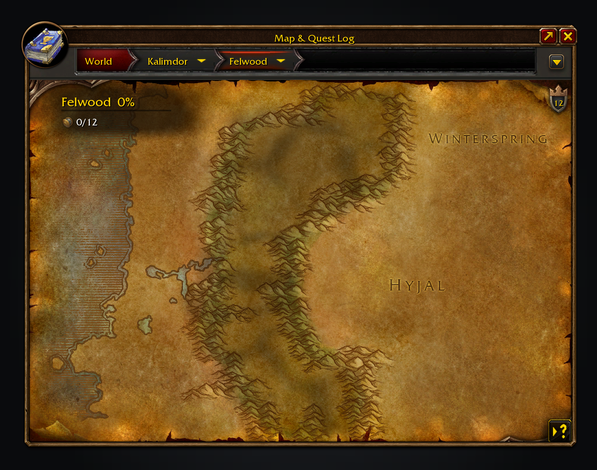

# What zone completion counts

Each category's objectives come from `Data/Legacy.lua`, which `tools/gen_legacy.py` generates, and your progress
is read from the game. The README says
[where the locations come from](../README.md#where-the-locations-come-from).

- **Areas** are the zone's map overlays, the same ones the game reveals as you explore.
- **Flight paths**, counted only once ticked under "What counts", are the client's flight nodes for your faction,
  placed by the zone in each node's name. The game only says which ones a character knows at a flight master, so
  flight paths count once you've opened one on that continent, and show as "?" until then. Special services with
  nothing to learn, such as the Nighthaven druid flights, are left out.
- **Dungeons** are the single-boss clears in the Legacy Spelunker challenges, by the zone of the instance entrance.
- **Raids** are the Conqueror challenges' bosses, by the zone of the raid entrance, and count once every boss is
  down; only Onyxia's Lair has an entrance in the client data so far.
- **Legacy objectives** are the zone's other placed Legacy steps, with a step's variants counted once.
- **Reputations**, also counted only once ticked, are a short curated list of factions tied to a single zone, such as
  Booty Bay for Stranglethorn.
- **Quests**, off until ticked, need [Questie](https://github.com/Questie/Questie) (12.0 or later, the first
  with Forever support) installed, or at least the QuestieDB addon it comes with; without it the tick box is greyed
  out. Legacy Forever ships no quest data: it reads QuestieDB in game (with Questie's list of quests the game never
  offers and its holidays, when Questie is loaded) and counts each quest your race and class can take in the zone,
  once, with either side of an exclusive choice counting as the same quest. Repeatable, daily and dungeon quests are
  left out, and so is any quest behind a profession, reputation or spell, or after a choice that could shut it,
  since whether you can take it isn't certain. A quest counts as done once you've turned it in, or its follow-up.
- **Rares** are left out: the client doesn't say which belong to a zone, and no openly licensed list covers Forever.
